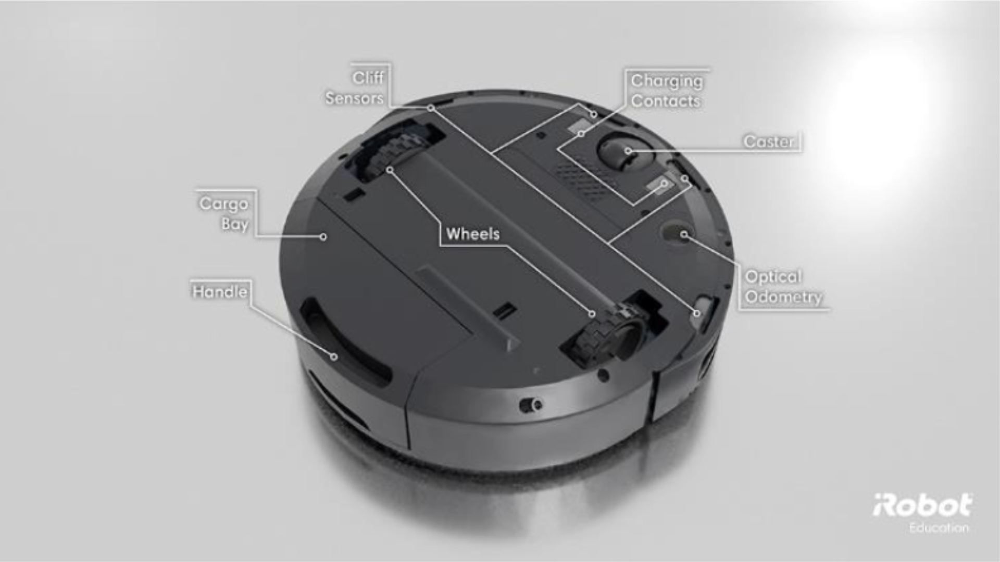

# iRobot Create 3 Roomba Programming

  
  

## Overview

This project involves programming the **iRobot Create 3 Roomba** to achieve multiple advanced functionalities. As the first-ever student at Georgia Tech to complete this project, I spearheaded a team in developing the iRobot Create 3 program functionality and worked closely with Dr. Rodrigo Borela (all lab creation credit due to him) to tailor his instruction for the first-time launch of the lab. 

By leveraging Python, the iRobot SDK, and the Roomba's onboard sensors, we developed a series of features that significantly enhance the Roomba's operational capabilities. These enhancements include password protection, ping pong functionality, object detection, collision warning/avoidance, and a dynamic maze-solving algorithm.

## Features

<h5>Password Protection:</h5>

Implemented a secure access mechanism to control and restrict the use of the Roomba, ensuring that only authorized users can operate the device.

  
  

**Infrared Sensors:** Utilized the Roomba's front-mounted IR sensors to implement an object collision detection system. This system allows the Roomba to sense obstacles in real-time, enabling it to navigate around objects and avoid collisions, ensuring smooth operation and protecting both the device and its surroundings.

  

**Ping Pong Functionality:** Developed a unique feature where the Roomba can engage in a simple ping pong interaction, showcasing the versatility of its motion and sensor capabilities.

  
  

**Object Detection and Collision Avoidance:** Utilized the Roomba's infrared (IR) sensors to detect obstacles in its path. The system not only warns the user of potential collisions but also employs an algorithm to autonomously navigate around obstacles, preventing accidents and ensuring smooth operation.

  
  

  
  

**Dynamic Maze Solving Algorithm with Cost Analysis:** Designed and implemented a sophisticated algorithm that leverages the Roomba's Cartesian coordinate navigation system, incorporating a cost analysis function. This allows the Roomba to navigate and solve complex mazes dynamically by assigning a cost to each cell in the maze. The algorithm evaluates these costs, taking into account factors such as distance and obstacles, to calculate the optimal path in real-time. By analyzing and minimizing the total cost of different routes, the Roomba efficiently adapts to various maze configurations and finds the most efficient path from start to finish.

