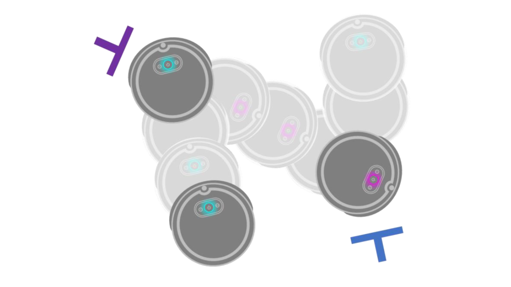

# iRobot Create3 Roomba Programming

  
  

## Overview

This project involves programming the **iRobot Create3 Roomba** to achieve multiple advanced functionalities. By leveraging Python, the iRobot SDK, and the Roomba's onboard sensors, we developed a series of features that significantly enhance the Roomba's operational capabilities. These enhancements include password protection, ping pong functionality, object detection, collision warning/avoidance, and a dynamic maze-solving algorithm.

## Features

**Password Protection:** Implemented a secure access mechanism to control and restrict the use of the Roomba, ensuring that only authorized users can operate the device.

**Infrared Sensors:** Utilized the Roomba's front-mounted IR sensors to implement an object collision detection system. This system allows the Roomba to sense obstacles in real-time, enabling it to navigate around objects and avoid collisions, ensuring smooth operation and protecting both the device and its surroundings.

**Ping Pong Functionality:** Developed a unique feature where the Roomba can engage in a simple ping pong interaction, showcasing the versatility of its motion and sensor capabilities.

  
  
  

**Object Detection and Collision Avoidance:** Utilized the Roomba's infrared (IR) sensors to detect obstacles in its path. The system not only warns the user of potential collisions but also employs an algorithm to autonomously navigate around obstacles, preventing accidents and ensuring smooth operation.

  
  
  

**Dynamic Maze Solving Algorithm:** Designed and implemented a sophisticated algorithm that leverages the Roomba's Cartesian coordinate navigation system. This allows the Roomba to navigate and solve complex mazes dynamically. The Roomba adapts to different maze configurations, efficiently finding its way from start to finish by mapping out the maze and calculating the optimal path in real-time.

